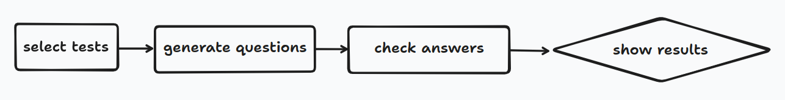

# question-generator
Script to practice with own made tests

### Requirements
1. Python 3.10
2. Pipenv
3. Install dependencies `pipenv install --dev`
4. Add own made tests in `app/infraestructure/tests/` in csv format <question, answer>
5. Execute `pipenv run python main.py`

